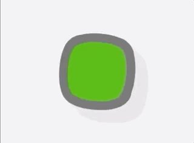

# Tic Tac Toe

[Play](https://ajayraveendran.github.io/Tic-Tac-Toe/)

### What it does?

Just your traditional tic tac toe game on a 
* 3x3 board, 
* with player counters and
* minimalistic visuals.

### Challenges along the way

* creating a working algorithm to decide a win,loss or draw.
* trying to not lose it during testing the above algorithm.

### Unfinished business

* Create an algorithm to pre populate winning combimations in JS instead of hard coding it.
* Get the winning combination to 'pulse' when a win is registered instead of the board clearing when a win occurs.
* Add page reload animation.
* Add functionality to insert player names and colour selectors.
* Add sounds and options to turn sound off and on.
* Add online playability.
* Carry out the above with the view of optimising for mobile.